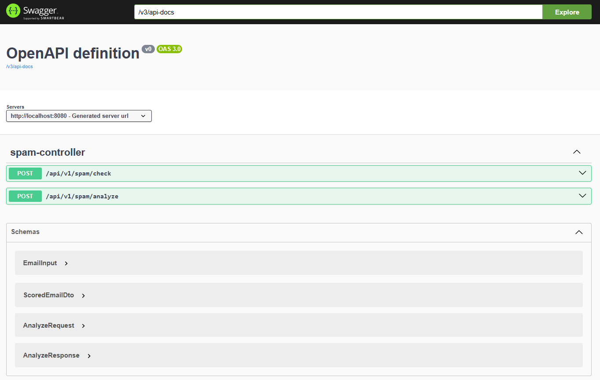
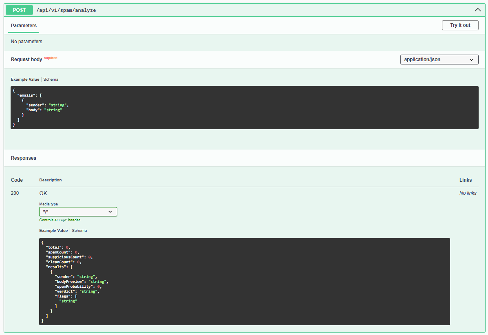

# spam-detector
A Java/Spring Boot app to identify phishing and scam campaigns.

---

## Scoring mechanism
**1. Whitelist domain check**
Check if the sender's domain is whitelisted the score is forced to 0.0 and further checks are skipped.

**2. Blacklist domain check**
Check if the sender's domain is blacklisted the score is floored at **blacklistDomainScore** (default 1.0) and further checks are skipped.

**3. Pattern matching check**
Check against known regex patterns (phishing, pharma, prize, …) each add a **scoreBoost** to the running total.</li>

**4. Blacklisted keyword check**
Check against configurable keyword list adds per-word boosts.

**5. Similarity check**
Check Jaccard similarity over word-shingles across the whole batch. Two flavours are combined:
**Max similarity** highest Jaccard against any other email.
**Cluster density** share of other emails that are "similar" (above a threshold).
This check works only with the batch currently, can be extended later for single emails when results are cached or persisted.

**6. Sender flood signal check**
Check if the same sender address appears many times in the batch, all their emails receive a boost.

---

## Background & Theory

The core of this service's cross-email detection logic is based on **Set Similarity** and **N-Gram Tokenization**.

### 1. Shingling (N-Grams)
To detect "fuzzy" matches where spammers change small details (synonyms, dates, links), we break the email body into overlapping sequences of words called "shingles."

**Concept:** Instead of matching the whole string, we match the underlying structure.

**Reading:** [An Introduction to N-Grams (Stanford NLP)](https://web.stanford.edu/~jurafsky/slp3/3.pdf)

### 2. Jaccard Similarity
Once emails are converted into sets of shingles, we calculate the Jaccard Index to determine how much of the content is shared.

**Reading:** [Jaccard Index](https://en.wikipedia.org/wiki/Jaccard_index), [Mining of Massive Datasets - Chapter 3: Finding Similar Items](http://www.mmds.org/mmds/v2.1/ch03.pdf)

### 3. Saturation
Checks are combined using a weighted approach and normalized via a saturation function to ensure the final score is a probability between `0.0` and `1.0`.

---

## Interactive API Documentation

I have included built-in OpenAPI 3 support via Swagger UI. This allows you to explore the data models, test the scoring logic, and execute API calls directly from your browser without using Terminal/CURL:

[Swagger UI (Interactive)](http://localhost:8080/swagger-ui/index.html)

[OpenAPI JSON Docs](http://localhost:8080/v3/api-docs)

Thresholds are defined in **application.yml** 

---

## Running and Testing

### Running the Application
* Run the service directly from your terminal using Gradle wrapper:
```bash
./gradlew bootRun
```
* Run the from the JAR
1. Build the standalone JAR first:
```bash
./gradlew build
```
2. Then run the JAR:
```bash
java -jar build/libs/spam-detector-0.0.1-SNAPSHOT.jar
```

### Testing the API

* **Testing using browser**
Open [Swagger OpenAPI](http://localhost:8080/swagger-ui/index.html) in the browser, and through `Try it out` button you can execute the API call with the test data.



* **Testing using terminal**

Use `curl` command to submit the request
```bash lines
curl -X POST http://localhost:8080/api/v1/spam/analyze \
  -H "Content-Type: application/json" \
  -d '{
    "emails": [
      {"sender": "trusted@tuta.com", "body": "Hello, your package is at the office. click here for tracking."},
      {"sender": "scammer@evil.com", "body": "Your invoice is ready. Please pay now."},
      {"sender": "bot1@scam.io", "body": "invest 500$ to get bitcoin profit now. investment opportunity!"},
      {"sender": "bot2@scam.io", "body": "invest 500$ for huge bitcoin profit today. investment opportunity!"}
    ]
  }'
```

* **Postman or Talend could be an option to test the API calls too.**

### Mockup data for Testing

* `/check` - Single Email
```json lines
{ "sender": "alert@untrusted.net", "body": "URGENT: account suspended due to unusual activity. click here to recover your account and avoid a billing failure."}
```

* `/analyze` - Batch of Emails
```json lines
{
  "emails": [
    { "sender": "trusted@tuta.com", "body": "Hello, your package is at the post office. click here for parcel tracking." },
    { "sender": "scammer@evil.com", "body": "Your invoice is ready. Please pay now." },
    { "sender": "bot1@scam.io", "body": "invest 500$ to get bitcoin profit now. investment opportunity of a lifetime!" },
    { "sender": "bot2@scam.io", "body": "invest 500$ for huge bitcoin profit today. investment opportunity you can't miss!" }
  ]
}
```

```json lines
{
  "emails": [
    {"sender": "attacker@scam.io", "body": "Claim your prize now!"},
    {"sender": "attacker@scam.io", "body": "Claim your reward points now!"},
    {"sender": "attacker@scam.io", "body": "Claim your gift card now!"},
    {"sender": "user@gmail.com", "body": "Are we still meeting at 5?"},
    {"sender": "jobs@tuta.com", "body": "Your password expires in 2 days."},
    {"sender": "travel@spamhaus.test", "body": "Claim your prize now! You won a limited time offer for a free luxury cruise. No hidden fees apply."},
    {"sender": "travel@spamhaus.test", "body": "Claim your gift card now! A limited time offer for a free tropical vacation is waiting for you."},
    {"sender": "travel@spamhaus.test", "body": "You have been selected to claim your prize! This limited time offer includes a 5-night stay with no hidden fees."},
    {"sender": "bot@bad.io", "body": "Passive income: double your money in a week!"},
    {"sender": "bot@bad.io", "body": "Passive income: double your crypto gains now!"},
    {"sender": "bot@bad.io", "body": "Passive income: double your bitcoin profit today!"},
    {"sender": "user@hotmail.com", "body": "Here is the document you have requested."},
    {"sender": "phish@phishing.example", "body": "unauthorized login detected on your account."},
    {"sender": "phish@phishing.example", "body": "unusual activity detected on your bank account."},
    {"sender": "delivery@offshore.test", "body": "failed delivery: shipping address update required."},
    {"sender": "delivery@offshore.test", "body": "customs fee due for your package."},
    {"sender": "profit@scam.io", "body": "investment platform: lucky recipient of 1 BTC."},
    {"sender": "profit@scam.io", "body": "investment platform: beneficiary of inheritance."},
    {"sender": "finance@company.example", "body": "Please review the attached quarterly results."},
    {"sender": "user2@gmail.com", "body": "Don't forget to pay the outstanding bill."}
  ]
}
```

---

## What is left? / Next Steps
* **Standardized Unit Testing:** Implement JUnit 5 suites to isolate and verify the core math (Jaccard similarity and saturation curves) in the service layer, while using MockMvc in the controller layer to ensure API contracts and HTTP status codes remain stable.
* **Automated Smoke Suite:** Formalize the existing CommandLineRunner logic into a dedicated Bootstrap Test Suite that runs on application startup. This provides an immediate "Green/Red" health check of our scoring sensitivity across all six core attack scenarios before the service accepts traffic.
* **Dynamic Pattern Management:** Expose a dedicated RESTful Pattern API (GET, POST, DELETE) to register new regex signatures or adjust scoreBoost values at runtime.
* **Persistent Pattern Storage:** Replace the volatile ConcurrentHashMap with a Database using Spring Data JPA. This ensures that any patterns added via API survive service restarts and can be shared across multiple running instances of the detector.
